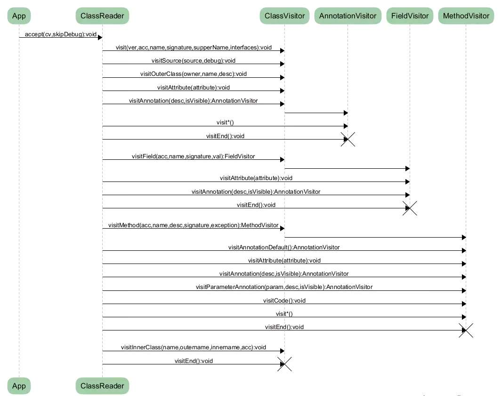

# AopDemo2
Javassist，ASM的使用

- javassist
    
    1.  ClassPool 字节码容器池
    2.  ClassPool 缓存字节码对象的容器，所有的Class字节码对象都在ClassPool中
    3.  CtClass
      对象很多时，ClassPool会消耗很大内存，为了避免内存消耗，构建对象时可使用单列模式
    4.  对于CtClass 对象，调用deatch方法将其从ClassPool移除
    5.  CtClass 里面包含CtField，CtConst,CtMethod
    6.  insertBefore ,insertAfter，insertAt，addCatch是其支持的属性
    7.  主要是以字符串的方式添加新的代码
    
- asm

  1.  AS使用 `Asm Bytecode Outline`/`jclasslib Bytecode viewer Ingo
      Kegel`插件查看字节码
      - Asm Bytecode Outline 使用是点击java文件，右键`show byteCode
        onlin`,右方出现弹框显示
      - jclasslib Bytecode viewer IngoKegel 使用菜单栏`View`中选择`Show
        Bytecode With jclasslib`
  2.  ClassVisitor 解析类，再使用其对应的xxxVisitor解析其他
  3.  在对应的xxxVisitor中插入字节码
  
  ```
  核心api：
    CoreApi基于访问者模式操作类
    TreeApi基于树节点操作类（继承coreApi，实质是coreApi的拓展，缓存了visitX的值，可以获取method/feilds等直接修改，而不是visitX的方式修改）
  流程：
    visit 
    -> visitSource 
    -> visitOuterClass 
    -> visitAnnotation/Attribute 
    -> visitInnerClass/Field/Method 
    visitEnd
  ```


- 总结：
    1.  ASM 比 javassist 占据内存更小，更快
    2.  ASM提供更多精细化的字节码操作
    3.  javassist会生成很多临时变量

- 操作文档 ：
  [字节码总结笔记](https://github.com/yanchunlan/SourceCodeSummary/blob/master/%E6%80%A7%E8%83%BD%E4%BC%98%E5%8C%96/%E6%9E%81%E8%87%B4%E6%80%A7%E8%83%BD%E4%BC%98%E5%8C%96%E6%80%BB%E7%BB%93/12_02%E5%AD%97%E8%8A%82%E7%A0%81%E7%9F%A5%E8%AF%86%E5%8F%8A%E6%A1%86%E6%9E%B6.txt)
  [ASM文档](https://asm.ow2.io/asm4-guide.pdf)
  
#### demo 中的案列解释 ：
- app： 
  -    build.gradle中校验了2个插件 'clicklistener'，'method-time-trace'

- asmlib： 

  -    sample01: 在方法开始，结束插入log
  -    sample02: 在方法开始，结束插入log
  -    sample03: 线程替换，并根据访问方法指令判断方法是否执行
  -    sample04: 在方法开始，结束添加try catch
  -    sample05: coreApi与treeApi两种方式实现线程池替换
  -    methodtime: 每个方法中开始，结束，打印指定的插桩方法
    
- javassistlib： 

  -   javassist: 拦截点击事件打印toast
  -   agent: 运行时，javassist插桩
  -   sample01: javassist生成文件的demo，在方法开始，结束插入log
  
#### 拓展 ：
- methodtime： 
    1.  支持栈深度定制，解决插桩方法栈深度太深导致的性能损耗问题，并支持清栈方法
        ```
        1>  插桩方法访问时，通过AtomicLong.getAndIncrement自增函数，给每个方法内的插桩start/end都赋值同一个id
        2>  插桩的代码调用时，通过ThreadLocal<Stack<Pair<Long, Integer>>>操作方法栈，入栈小于栈深就存储并执行
        Trace.beginSection，出站等于方法栈id就弹出并执行Trace.endSection
        3>  提供一个工具类，通过它get/set设置属性(栈深、是否清栈)，并在每次入栈存储方法栈之前调用判断
        ```
    2.  增量更新
    3.  开线程池支持并行多线程执行
    4.  编译信息反馈数据(json/html/println/Logger)
        实质就是IO存储操作，插桩信息存储在本地Bean中，通过相对应的io操作存储到本地
        ```
        // json
        file.withOutputStream {
            it.write(new Gson().toJson(xxx).getBytes("utf-8"))
        }
        // html
        Writer writer = new BufferedWriter(new FileWriter(new File(xxx)));
        writer.append("<html>")
              .append("<head>").append("<meta charset=\"utf-8\">")
              ...
              .append("</body>")
              .append("</html>")
        writer.flush();
        writer.close();
        // systemOutput
        System.out.println(xxx)
        // systemLogger
        Logging.getLogger("xxx").log(xxx)
        ```
    
 
    
